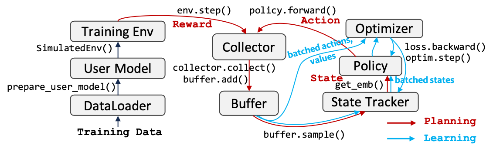

#任务分解

---
### 主设定1：基于用户模型的两阶段学习

**流程：DORL**
已实现算法: 
1. A2C

待实现: 
- 所有在线强化学习算法（基于tianshou库）。

##### 已经实现State_tracker:

1. Average
2. GRU
3. NextItNet
4. SASRec
5. Caser 

---
## 主设定2：离线RL，直接学习

已实现算法：

    1. BCQ
    2. CQL 
    3. CQL
    4. SQN

待实现：

- 辛鑫一系列算法（需要列举调研）
- 快手一系列算法（需要列举调研）

---
## 评测

### 评测方式：

##### Option 1: 直接Off-policy评测，适用于CTR任务
*Todo*

##### Option 2: 模拟环境，适用于Ranking任务，以及累计收益

CollectionSet里已实现三种setting：

    1. Feel bored then quit (推荐可重复)
    2. Feel bored then quit (推荐不可重复)
    3. No quit mechanism for X rounds (推荐不可重复)

###### 数据集：
    1. Coat
    2. Yahoo
    3. KuaiRec
    4. KuaiRand
    5. MovieLens (ML-1M) *Todo*
    6. *TODO*

### 文档及开源

### 文档：
自动生成 *Todo*

### 开源：
做成pip可安装包 *Todo*