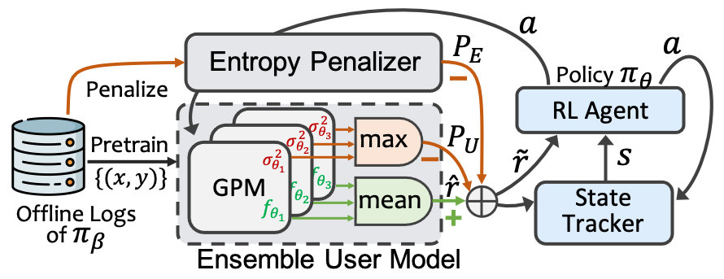

# Alleviating Matthew Effect of Offline Reinforcement Learning in Interactive Recommendation
[](https://github.com/chongminggao/DORL-codes/blob/main/LICENSE)

<div style="text-align: center;">

</div>

This repository provides the official PyTorch implementation and reproduction for the paper titled "Alleviating Matthew Effect of Offline Reinforcement Learning in Interactive Recommendation." Additionally, it includes four RL environments: `CoatEnv-v0`, `Yahoo-v0`, `KuaiEnv-v0`, and `KuaiRand-v0`. The latter two environments are specifically used in the paper, whose descriptions can be referred to as the two websites: 
[KuaiRec](https://kuairec.com/) and [KuaiRand](https://kuairand.com/).

More descriptions are available via the [paper](#) and this [slides](#).


If this work helps you, please kindly cite our papers:
```tex
@inproceedings{gao2023alleviating,
  title = {Alleviating Matthew Effect of Offline Reinforcement Learning in Interactive Recommendation},
  author = {Gao, Chongming and Huang, Kexin and Chen, Jiawei and Zhang, Yuan and Li, Biao and Jiang, Peng and Wang, Shiqi and Zhang, Zhong and He, Xiangnan},
  booktitle = {Proceedings of the 46th International ACM SIGIR Conference on Research and Development in Information Retrieval},
  series = {SIGIR '23},
  location = {Taipei, Taiwan},
  url = {https://doi.org/10.1145/3539618.3591636},
  doi = {10.1145/3539618.3591636},
  numpages = {11},
  year = {2023}
}
```

## Installation

1. Clone this git repository and change directory to this repository:

    ```shell
    git clone https://github.com/chongminggao/DORL-codes.git
    cd DORL-codes/
    ```

2. A new [conda environment](https://docs.conda.io/projects/conda/en/latest/user-guide/concepts/environments.html) is suggested. 

    ```bash
    conda create --name DORL python=3.10 -y
    ```

3. Activate the newly created environment.

    ```bash
    conda activate DORL
    ```

4. Install the required modules from pip.

    ```bash
    sh install.sh
    ```
   Install the tianshou package from my forked version:
   ```bash
   cd src
   git clone https://github.com/chongminggao/tianshou.git
   cd ..
   ```


## Download the data
1. Download the compressed dataset

    ```bash 
    wget https://chongming.myds.me:61364/DORL/environments.tar.gz
    ```
   or you can manually download it from this website:
   https://rec.ustc.edu.cn/share/9fe264f0-ae09-11ed-b9ef-ed1045d76757
   


2. Uncompress the downloaded `environments.tar.gz` and put the files to their corresponding positions.

   ```bash
   tar -zxvf environments.tar.gz
   ```
   Please note that the decompressed file size is as high as 12GB. This is due to the large space occupied by the ground-truth of the user-item interaction matrix. 
   
If things go well, you can run the following examples now！Or you can just reproduce the results in the paper.

---
## Examples to run the code

The argument `env` of all experiments can be set to one of the four environments: `CoatEnv-v0, Yahoo-v0, KuaiEnv-v0, KuaiRand-v0`. The former two datasets (coat and yahoo) are small so the models can run very quickly.


#### 1. Run traditional DQN-based baselines (e.g., BCQ or SQN) 

The examples are illustrated on  `CoatEnv-v0` , which runs quickly.

**Step 1:** You should run the static user model (DeepFM) to get the embedding of users and items. 

```shell
  python run_worldModel_ensemble.py --env CoatEnv-v0  --cuda 0 --epoch 5 --tau 0 --loss "pointneg" --message "pointneg"
```
Where argument `message` is a maker for naming the saved files. For example, by setting `--message "pointneg"`, you will get all saved files with names contains `"pointneg"`. Here, "pointneg" is just a loss that we use, and you can replace this message to any other words that you like.   

**Step 2:** Run the RL policy. By default, we use the user/item embeddings trained from the last step. There are many policies. Here, we run the BCQ and SQN for example:

Run BCQ:
   ```bash 
   python run_Policy_BCQ.py  --env CoatEnv-v0  --seed 0 --cuda 0    --which_tracker avg --reward_handle "cat"  --unlikely-action-threshold 0.6 --window_size 3 --read_message "pointneg"  --message "BCQ"
   ```
Run SQN:
   ```bash
   python run_Policy_SQN.py  --env CoatEnv-v0   --seed 0 --cuda 0   --num_leave_compute 1 --leave_threshold 0 --which_tracker avg --reward_handle "cat"  --window_size 3 --read_message "pointneg"  --message "SQN"
   ```


#### 2. Run model-based method, i.e., DORL, MBPO, and MOPO.

The examples are illustrated on  `KuaiRec-v0` , which runs a little bit slowly compared to codes above.

DORL can only be implemented it on the `KuaiEnv-v0` or `KuaiRand-v0` environments, since the two datasets contains recommendation logs that Coat and Yahoo datasets do not have. 

The procedure still contains two steps: 

**Step 1:** run the static user model (DeepFM) to get the embedding of users and items.

```shell
python run_worldModel_ensemble.py --env KuaiEnv-v0  --cuda 0 --epoch 5 --loss "pointneg" --message "pointneg"
```

Where argument `message` is a maker for naming the saved files. For example, by setting `--message "pointneg"`, you will get all saved files with names contains `"pointneg"`. Here, "pointneg" is just a loss that we use, and you can replace this message to any other words that you like.   

**Step 2:** Run the RL policy. Use the argument `--read_message "pointneg"` to make sure that the embeddings and rewards are generated from the model trained in step 1.

Run DORL (Our proposed method):

   ```bash 
python run_Policy_Main.py --env KuaiEnv-v0  --seed 0 --cuda 0  --num_leave_compute 1 --leave_threshold 0 --which_tracker avg --reward_handle "cat" --lambda_variance 0.01 --lambda_entropy 0.05  --window_size 3 --read_message "pointneg"  --message "DORL" &
   ```

Run MBPO (the vanilla model-based offline RL method):

```shell
python run_Policy_Main.py --env KuaiEnv-v0  --seed 0 --cuda 0   --num_leave_compute 1 --leave_threshold 0 --which_tracker avg --reward_handle "cat" --lambda_variance 0   --lambda_entropy 0    --window_size 3 --read_message "pointneg"  --message "MBPO" &
```

Run MOPO (the model-based RL method considering distributional shift):

```shell
python run_Policy_Main.py --env KuaiEnv-v0  --seed 0 --cuda 0   --num_leave_compute 1 --leave_threshold 0 --which_tracker avg --reward_handle "cat" --lambda_variance 0.05 --lambda_entropy 0    --window_size 3 --read_message "pointneg"  --message "MOPO" &
```

---
## Reproduce the results of the paper

To reproduce the main results of the paper, follow these three steps:

1. Run the scripts to execute the experiments and generate the log files.
2. Collect the log files and place them in the designated directories.
3. Visualize the results and recreate the main figures and tables presented in the paper.

We have completed the first two steps and have prepared all the required log files. You can proceed directly to the third step to visualize the results.

### Step 1: Re-running the Experiments

All the necessary parameters are already configured for reproducing the results. We have fixed the random seed to ensure consistency of results on the same machine. However, please note that results may vary when running the experiments on different machines.

For efficient execution, different methods can be run in parallel by appending `&` at the end of each shell command. Make sure to adjust the `--cuda` parameter in each line according to the available GPU memory on your server. We recommend using a server with 8 GPUs.

Before proceeding, ensure that you have installed the required environment and downloaded the datasets. Refer to the [installation guide](https://github.com/chongminggao/DORL-codes#installation) for detailed guidance.

The following scripts are specifically designed to reproduce Figure 7 as presented in the paper.

##### 1. Train the static user models as well as static baseline methods.

**For KuaiEnv:**
```shell
python run_worldModel_IPS.py --env KuaiEnv-v0  --seed 0 --cuda 0 --loss "pointneg" --message "DeepFM-IPS" &
python run_linUCB.py         --env KuaiEnv-v0  --num_leave_compute 4  --leave_threshold 0 --epoch 200 --seed 0 --cuda 0 --loss "pointneg" --message "UCB" &
python run_epsilongreedy.py  --env KuaiEnv-v0  --num_leave_compute 4  --leave_threshold 0 --epoch 200 --seed 0 --cuda 1 --loss "pointneg" --message "epsilon-greedy" &
python run_worldModel_ensemble.py --env KuaiEnv-v0  --cuda 0 --epoch 5 --loss "pointneg" --message "pointneg" &
```

**For KuaiRand:**
```shell
python run_worldModel_IPS.py --env KuaiRand-v0  --seed 0 --cuda 0 --loss "pointneg" --message "DeepFM-IPS" &
python run_linUCB.py         --env KuaiRand-v0  --num_leave_compute 4  --leave_threshold 0 --epoch 200 --seed 0 --cuda 2 --loss "pointneg" --message "UCB" &
python run_epsilongreedy.py  --env KuaiRand-v0  --num_leave_compute 4  --leave_threshold 0 --epoch 200 --seed 0 --cuda 3 --loss "pointneg" --message "epsilon-greedy" &
python run_worldModel_ensemble.py --env KuaiRand-v0  --cuda 0 --epoch 5 --loss "pointneg" --message "pointneg" &
```

Before proceeding to the next stage, it is important to ensure that all ongoing processes or experiments have been completed. 

##### 2. Learn the RL policies.  
**For KuaiEnv:**
```shell
python run_Policy_SQN.py  --env KuaiEnv-v0  --seed 0 --cuda 4   --num_leave_compute 1 --leave_threshold 0 --which_tracker avg --reward_handle "cat"  --window_size 3 --read_message "pointneg"  --message "SQN" &
python run_Policy_CRR.py  --env KuaiEnv-v0  --seed 0 --cuda 5   --num_leave_compute 1 --leave_threshold 0 --which_tracker avg --reward_handle "cat"  --window_size 3 --read_message "pointneg"  --message "CRR" &
python run_Policy_CQL.py  --env KuaiEnv-v0  --seed 0 --cuda 6   --num_leave_compute 1 --leave_threshold 0 --which_tracker avg --reward_handle "cat"  --num-quantiles 20 --min-q-weight 10 --window_size 3 --read_message "pointneg"  --message "CQL" &
python run_Policy_BCQ.py  --env KuaiEnv-v0  --seed 0 --cuda 7   --num_leave_compute 1 --leave_threshold 0 --which_tracker avg --reward_handle "cat"  --unlikely-action-threshold 0.6 --window_size 3 --read_message "pointneg"  --message "BCQ" &
python run_Policy_IPS.py  --env KuaiEnv-v0  --seed 0 --cuda 7   --num_leave_compute 1 --leave_threshold 0 --which_tracker avg --reward_handle "cat" --lambda_variance 0    --lambda_entropy 0    --window_size 3 --read_message "DeepFM-IPS"  --message "IPS" &
python run_Policy_Main.py --env KuaiEnv-v0  --seed 0 --cuda 7   --num_leave_compute 1 --leave_threshold 0 --which_tracker avg --reward_handle "cat" --lambda_variance 0    --lambda_entropy 0    --window_size 3 --read_message "pointneg"  --message "MBPO" &
python run_Policy_Main.py --env KuaiEnv-v0  --seed 0 --cuda 7   --num_leave_compute 1 --leave_threshold 0 --which_tracker avg --reward_handle "cat" --lambda_variance 0.05 --lambda_entropy 0    --window_size 3 --read_message "pointneg"  --message "MOPO" &
python run_Policy_Main.py --env KuaiEnv-v0  --seed 0 --cuda 7   --num_leave_compute 1 --leave_threshold 0 --which_tracker avg --reward_handle "cat" --lambda_variance 0.05 --lambda_entropy 5    --window_size 3 --read_message "pointneg"  --message "DORL" &
```

**For KuaiRand:**
```shell
python run_Policy_SQN.py  --env KuaiRand-v0  --seed 0 --cuda 3   --num_leave_compute 1 --leave_threshold 0 --which_tracker avg --reward_handle "cat" --window_size 3 --read_message "pointneg"  --message "SQN" &
python run_Policy_CRR.py  --env KuaiRand-v0  --seed 0 --cuda 2   --num_leave_compute 1 --leave_threshold 0 --which_tracker avg --reward_handle "cat" --window_size 3 --read_message "pointneg"  --message "CRR" &
python run_Policy_CQL.py  --env KuaiRand-v0  --seed 0 --cuda 1   --num_leave_compute 1 --leave_threshold 0 --which_tracker avg --reward_handle "cat" --num-quantiles 20 --min-q-weight 10 --window_size 3 --read_message "pointneg"  --message "CQL" &
python run_Policy_BCQ.py  --env KuaiRand-v0  --seed 0 --cuda 0   --num_leave_compute 1 --leave_threshold 0 --which_tracker avg --reward_handle "cat" --unlikely-action-threshold 0.6 --window_size 3 --read_message "pointneg"  --message "BCQ" &
python run_Policy_IPS.py  --env KuaiRand-v0  --seed 0 --cuda 7   --num_leave_compute 1 --leave_threshold 0 --which_tracker avg --reward_handle "cat" --lambda_variance 0    --lambda_entropy 0     --window_size 3 --read_message "DeepFM-IPS"  --message "IPS" &
python run_Policy_Main.py --env KuaiRand-v0  --seed 0 --cuda 7   --num_leave_compute 1 --leave_threshold 0 --which_tracker avg --reward_handle "cat" --lambda_variance 0    --lambda_entropy 0     --window_size 3 --read_message "pointneg"  --message "MBPO" &
python run_Policy_Main.py --env KuaiRand-v0  --seed 0 --cuda 7   --num_leave_compute 1 --leave_threshold 0 --which_tracker avg --reward_handle "cat" --lambda_variance 0.01 --lambda_entropy 0     --window_size 3 --read_message "pointneg"  --message "MOPO" &
python run_Policy_Main.py --env KuaiRand-v0  --seed 0 --cuda 7   --num_leave_compute 1 --leave_threshold 0 --which_tracker avg --reward_handle "cat" --lambda_variance 0.01 --lambda_entropy 0.05  --window_size 3 --read_message "pointneg"  --message "DORL" &
```

---
### Step 2: Collecting Results by Copying Log Files

To visualize Figure 7, you need to ensure that the log files are saved in the specified structure outlined below.

(We have already prepared all the required files for you, so you can proceed directly to step 3 without having to perform steps 1 and 2. However, if you wish to run the process yourself, please copy your logs from `/saved_models` and replace the logs under `\results_for_paper` accordingly).

```
results_for_paper
├── figures
│   ├── leave.pdf
│   ├── main_result.pdf
│   └── main_result_table.tex
├── results_all
│   ├── kuairand
│   │   ├── [BCQ-leave4]_2023_01_17-19_28_00.log
│   │   ├── [CQL-leave4]_2023_01_17-19_28_01.log
│   │   ├── [CRR-leave4]_2023_01_17-19_28_01.log
│   │   ├── [DORL]_2023_01_19-08_20_56.log
│   │   ├── [IPS-leave4]_2023_01_17-19_28_00.log
│   │   ├── [MBPO]_2023_01_18-17_45_46.log
│   │   ├── [MOPO]_2023_01_19-08_21_04.log
│   │   ├── [SQN-leave4]_2023_01_17-19_28_00.log
│   │   ├── [UCB]_2023_01_18-18_17_21.log
│   │   └── [epsilon-greedy]_2023_01_18-18_17_22.log
│   └── kuairec
│       ├── [BCQ-leave4]_2023_01_17-19_28_01.log
│       ├── [CQL-leave4]_2023_01_17-19_28_01.log
│       ├── [CRR-leave4]_2023_01_17-19_28_00.log
│       ├── [DORL]_2023_01_18-17_45_45.log
│       ├── [IPS-leave4]_2023_01_17-19_28_00.log
│       ├── [MBPO]_2023_01_18-17_45_45.log
│       ├── [MOPO]_2023_01_18-17_45_45.log
│       ├── [SQN-leave4]_2023_01_17-19_28_01.log
│       ├── [UCB]_2023_01_18-18_17_21.log
│       └── [epsilon-greedy]_2023_01_18-18_17_21.log
├── results_leave
│   ├── kuairand
│   │   ├── [BCQ-leave10]_2023_01_17-19_59_30.log
│   │   ├── [BCQ-leave1]_2023_01_17-18_57_27.log
│   │   ├── [BCQ-leave2]_2023_01_17-19_23_40.log
│   │   ├── ... (Omitted 94 log files)
│   │   ├── [epsilon-greedy-leave7]_2023_01_18-17_11_26.log
│   │   ├── [epsilon-greedy-leave8]_2023_01_18-17_11_26.log
│   │   └── [epsilon-greedy-leave9]_2023_01_18-17_11_26.log
│   └── kuairec
│       ├── [BCQ-leave10]_2023_01_17-19_55_04.log
│       ├── [BCQ-leave1]_2023_01_17-18_57_26.log
│       ├── [BCQ-leave2]_2023_01_17-19_23_40.log
│       ├── ... (Omitted 94 log files)
│       ├── [epsilon-greedy-leave7]_2023_01_18-17_13_38.log
│       ├── [epsilon-greedy-leave8]_2023_01_18-17_13_40.log
│       └── [epsilon-greedy-leave9]_2023_01_18-17_13_40.log
├── visual_leave.py
├── visual_main_figure.py
├── visual_utils.py
└── visual_var.py
```

---

### Step 3. Visualize the results.

We have already prepared those logs in this repository. So you can directly visualize the results via this Jupyter Notebook file: [visualize_main_results.ipynb](./results_for_paper/visualize_main_results.ipynb).

All generated figures and tables are saved under [figures](results_for_paper/figures).
