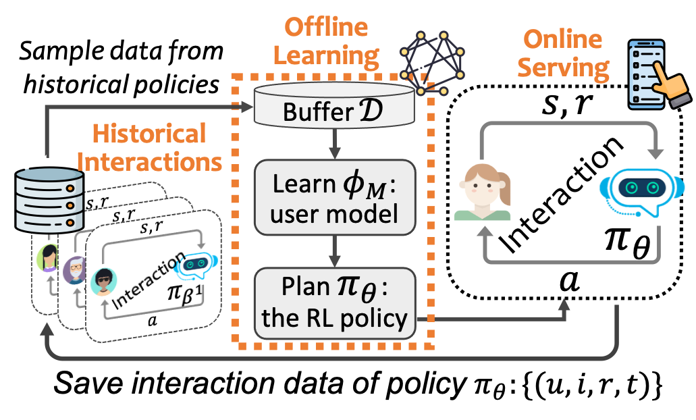
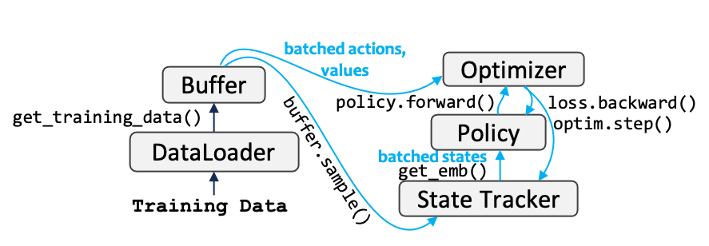
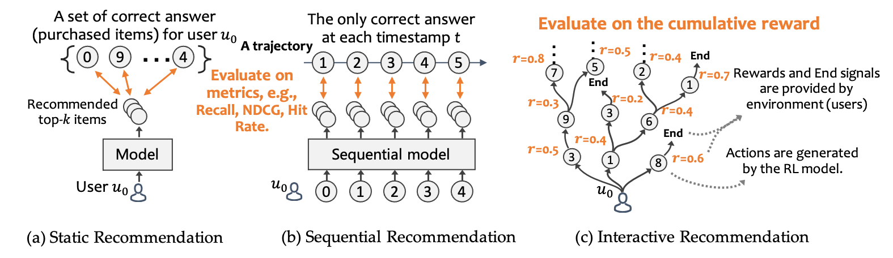
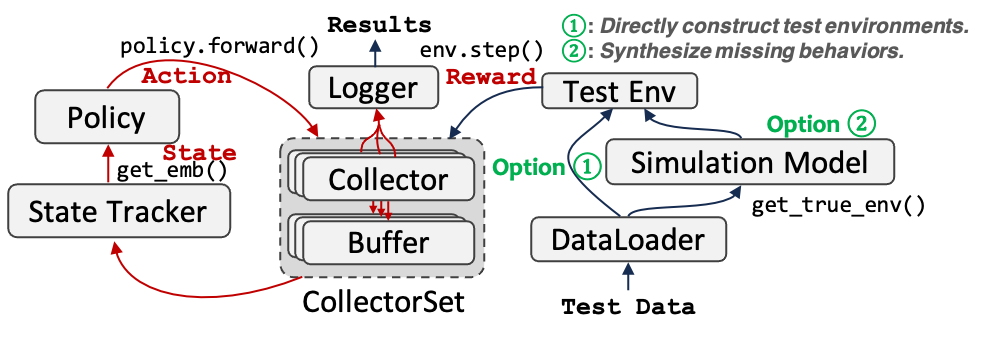

# OpenRL4Rec

**(Still under development)**

OpenRL4Rec is a user-friendly, modular, and extensible library designed for the implementation of reinforcement learning (RL) algorithms in recommendation systems.

[](https://github.com/chongminggao/DORL-codes/blob/main/LICENSE)


It consists of two Offline RL training pipelines:
#### 1. Learning with a user model (i.e., reward model)
This is similar to ChatGPT's RLHF learning paradigm, in which a reward model is learned in advanced to capture users' preferences and then is used to guide the learning of any RL policy.

Its learning pipeline is as the following figure. We first learn a user model $\phi_M$ via supervised learning (which is a traditional recommendation model such as DeepFM), and use $\phi_M$ to provide rewards for learning the core policy $\pi_\theta$.
<div style="text-align: center;">

</div>

The implementation of this paradigm in this package is as follows:
<div style="text-align: center;">

</div>


#### 2. Learning directly from offline logs
This setting assume all data are users' behavior logs (instead of ratings). Hence, the classic offline RL methods such as BCQ, CQL, and CRR can be learned directly on such data. 

Note that compared with the first setting, this setting has no planning stage in training. And its implementation is as follows:

<div style="text-align: center;">

</div>

---
#### Offline Evaluation

Here, we emphasize the most notable difference between the interactive recommendation setting and traditional sequential recommendation settings.  The following figure illustrates the learning and evaluation processes in sequential and interactive recommendation settings. Sequential recommendation uses the philosophy of supervised learning, i.e., evaluating the top-$k$ results by comparing them with a set of "*correct*" answers in the test set and computing metrics such as Precision, Recall, NDCG, and Hit Rate. By contrast, interactive recommendation evaluates the results by accumulating the rewards along the interaction trajectories. There is no standard answer in interactive recommendation, which is challenging.

<div style="text-align: center;">

</div>

In offline evaluation, we cannot obtain users' real-time feedback towards the recommended items. The are two options that we can choose to construct the test environment:
   1. Option 1: Use the offline test data to evaluate the policy directly through off-policy evaluation, such as [paper](https://arxiv.org/abs/2212.02779), [paper](https://arxiv.org/abs/2206.02620).
   2. Option 2: Creat a simulated environment using a simulated model. For example, using a MF model to predict the missing values in the user-itemp matrix ([paper](https://dl.acm.org/doi/10.1145/3383313.3412252)) and define a certain quit mechanism for ending the interaction, such as [KuaiEnv](https://github.com/chongminggao/CIRS-codes/#kuaishouenv). 

The implementation is as follows:
<div style="text-align: center;">

</div>


---
#### TODO: The following description is only for development purposes. It follows its foundation repo [DORL-codes](https://github.com/chongminggao/DORL-codes): and will be changed in the future.


## Installation

1. Clone this git repository and change directory to this repository:

    ```shell
    git clone https://github.com/chongminggao/OpenRL4Rec.git
    cd OpenRL4Rec/
    ```

2. A new [conda environment](https://docs.conda.io/projects/conda/en/latest/user-guide/concepts/environments.html) is suggested. 

    ```bash
    conda create --name openrl4rec python=3.11 -y
    ```

3. Activate the newly created environment.

    ```bash
    conda activate openrl4rec
    ```

4. Install the required modules from pip.

    ```bash
    sh install.sh
    ```
   Install the tianshou package from my forked version:
   ```bash
   cd src
   git clone https://github.com/yuyq18/tianshou.git
   cd ..
   ```


## Download the data
1. Download the compressed dataset

    ```bash 
    wget https://nas.chongminggao.top:4430/openrl4rec/environments.tar.gz
    ```
   or you can manually download it from this website:
   https://rec.ustc.edu.cn/share/a0b07110-91c0-11ee-891e-b77696d6db51
   


2. Uncompress the downloaded `environments.tar.gz` and put the files to their corresponding positions.

   ```bash
   tar -zxvf environments.tar.gz
   ```
   Please note that the decompressed file size is as high as 12GB. This is due to the large space occupied by the ground-truth of the user-item interaction matrix. 
   

If things go well, you can run the following examples now！Or you can just reproduce the results in the paper.

---
## Examples to run the code

The argument `env` of all experiments can be set to one of the four environments: `CoatEnv-v0, Yahoo-v0, KuaiEnv-v0, KuaiRand-v0`. The former two datasets (coat and yahoo) are small so the models can run very quickly.


### Run user model
```shell
python examples/usermodel/run_DeepFM_ensemble.py --env KuaiEnv-v0  --seed 2023 --cuda 0 --epoch 5 --loss "pointneg" --message "pointneg"

python examples/usermodel/run_DeepFM_IPS.py      --env KuaiEnv-v0  --seed 2023 --cuda 1 --epoch 5 --loss "pointneg" --message "DeepFM-IPS"

python examples/usermodel/run_Egreedy.py         --env KuaiEnv-v0  --num_leave_compute 4  --leave_threshold 0 --epoch 5 --seed 2023 --cuda 2 --loss "pointneg" --message "epsilon-greedy"

python examples/usermodel/run_LinUCB.py          --env KuaiEnv-v0  --num_leave_compute 4  --leave_threshold 0 --epoch 5 --seed 2023 --cuda 3 --loss "pointneg" --message "UCB"
```


### Run policy
#### 1. Offline RL(Batch RL) (offpolicy)
```shell
python examples/policy/run_SQN.py --env KuaiEnv-v0  --seed 2023 --cuda 0 --epoch 10  --num_leave_compute 1 --leave_threshold 0 --which_tracker avg --reward_handle "cat"  --window_size 3 --read_message "pointneg"  --message "SQN"

python examples/policy/run_CRR.py --env KuaiEnv-v0  --seed 2023 --cuda 0 --epoch 10  --num_leave_compute 1 --leave_threshold 0 --which_tracker avg --reward_handle "cat"  --window_size 3 --read_message "pointneg"  --message "CRR"

python examples/policy/run_CQL.py --env KuaiEnv-v0  --seed 2023 --cuda 1 --epoch 10  --num_leave_compute 1 --leave_threshold 0 --which_tracker avg --reward_handle "cat"  --num-quantiles 20 --min-q-weight 10 --window_size 3 --read_message "pointneg"  --message "CQL"

python examples/policy/run_BCQ.py --env KuaiEnv-v0  --seed 2023 --cuda 1 --epoch 10  --num_leave_compute 1 --leave_threshold 0 --which_tracker avg --reward_handle "cat"  --unlikely-action-threshold 0.6 --window_size 3 --read_message "pointneg"  --message "BCQ"
```

#### 2. Online RL with User Model(Model-based) 
##### 2.1 onpolicy
```shell
python examples/policy/run_A2C_IPS.py --env KuaiEnv-v0  --seed 2023 --cuda 1 --epoch 10  --num_leave_compute 1 --leave_threshold 0 --which_tracker avg --reward_handle "cat" --window_size 3 --read_message "DeepFM-IPS"  --message "IPS"

python examples/policy/run_A2C.py     --env KuaiEnv-v0  --seed 2023 --cuda 1 --epoch 10  --num_leave_compute 1 --leave_threshold 0 --which_tracker gru --reward_handle "cat" --window_size 3 --read_message "pointneg"  --message "A2C"
```

#####  2.2 offpolicy
```shell
python examples/policy/run_DQN.py     --env KuaiEnv-v0  --seed 2023 --cuda 0 --epoch 10  --num_leave_compute 1 --leave_threshold 0 --which_tracker avg --reward_handle "cat" --window_size 3 --is_random_init --read_message "pointneg"  --message "DQN-test" 
```

### run advance
```shell
python examples/advance/run_MOPO.py   --env KuaiEnv-v0  --seed 2023 --cuda 3 --epoch 10  --num_leave_compute 1 --leave_threshold 0 --which_tracker avg --reward_handle "cat" --lambda_variance 0.05 --window_size 3 --read_message "pointneg"  --message "MOPO"

python examples/advance/run_DORL.py   --env KuaiEnv-v0  --seed 2023 --cuda 0 --epoch 10  --num_leave_compute 1 --leave_threshold 0 --which_tracker avg --reward_handle "cat" --lambda_entropy 5     --window_size 3 --read_message "pointneg"  --message "DORL"

python examples/advance/run_Intrinsic.py --env KuaiEnv-v0  --seed 2023 --cuda 0 --epoch 10  --num_leave_compute 1 --leave_threshold 0 --which_tracker avg --reward_handle "cat" --lambda_diversity 0.1 --lambda_novelty 0.1 --window_size 3 --read_message "pointneg"  --message "Intrinsic"
```